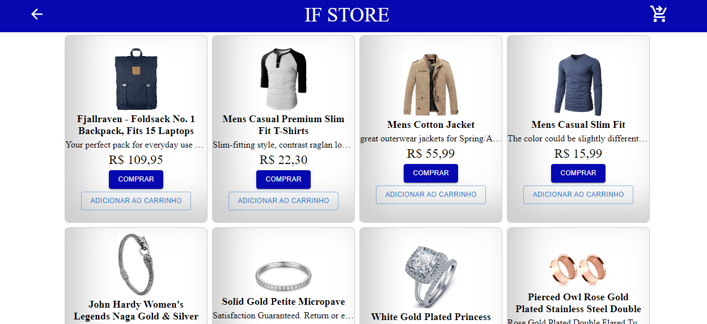
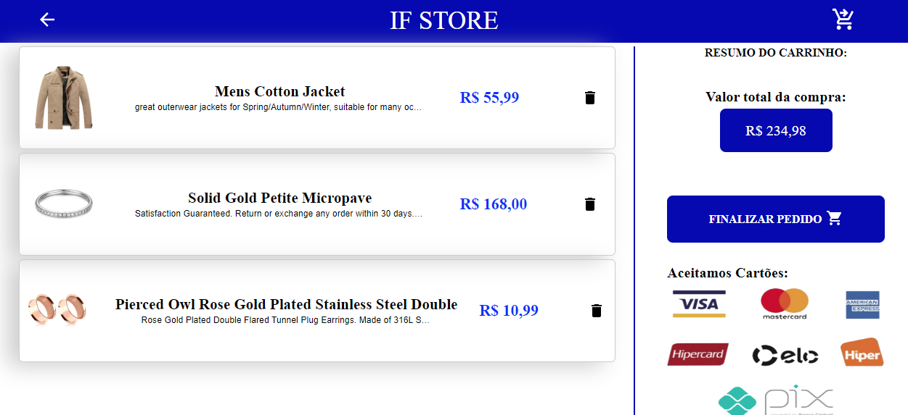

<h1 align='center'> E-commerce</h1>

> 
>
> 

 ### Sobre o app 
 Site desenvolvido por mim utilizando TypeScript, ReactJS e Material UI. Com a finalidade de consolidar os conceitos relacionados a essas tecnologias.

### Tecnologias utilizadas 🛠️:
> - TypeScript
> - ReactJS
> - Material UI

### Alterações previstas ⚠️:
> - Tornar a aplicação responsiva
> - Criação e integração com o back-end
> - Implementação da Stripe API
